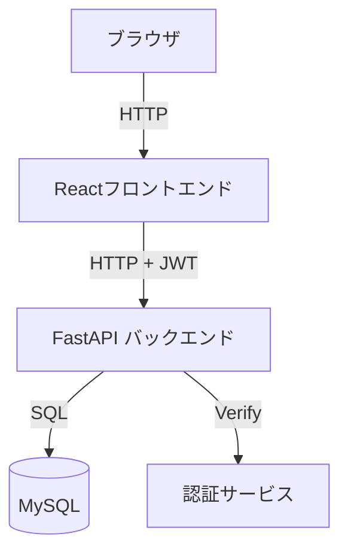
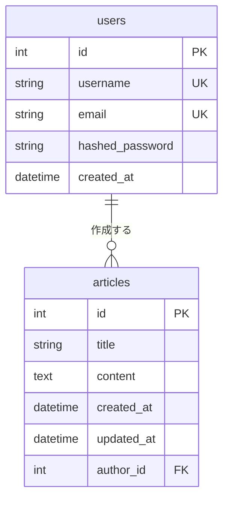
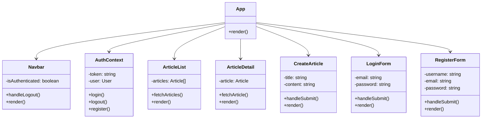
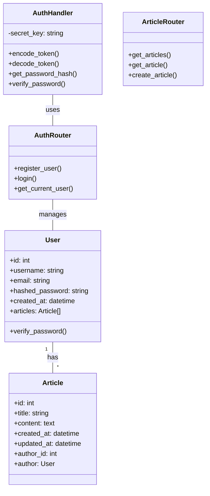
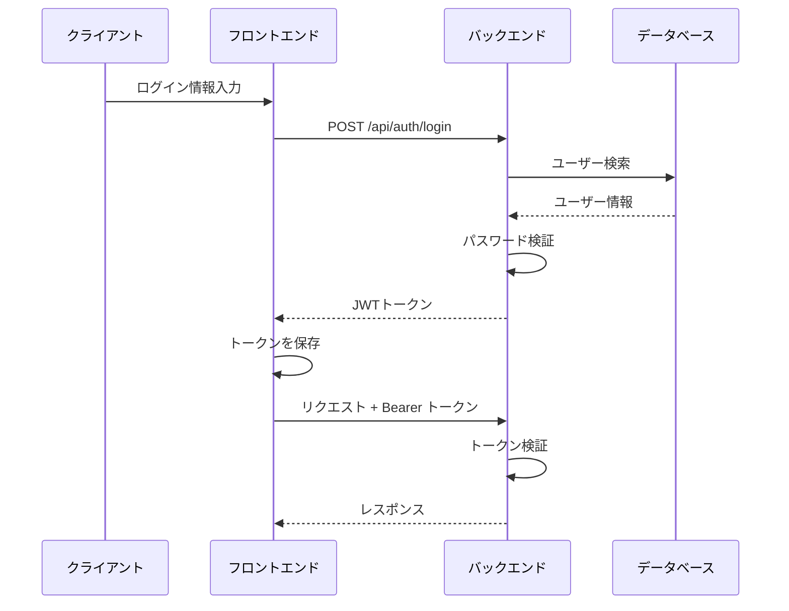

# エンジニアブログプラットフォーム 設計書

## 1. システム概要
エンジニア向けの技術ブログプラットフォーム。Qiitaライクな記事投稿・閲覧機能を提供する。

## 2. 技術スタック
### フロントエンド
- React 18.2.0
- Material-UI (MUI) 5.14.15
- React Router DOM 6.17.0
- Axios 1.6.0

### バックエンド
- FastAPI 0.104.1
- SQLAlchemy 2.0.23
- PyMySQL 1.1.0
- python-jose (JWT認証)
- passlib (パスワードハッシュ化)
- bcrypt (パスワードハッシュ化アルゴリズム)

### データベース
- MySQL

## 3. システム構成図

## 4. データベース設計
### ER図

## 5. APIエンドポイント設計
### 認証関連 API
| メソッド | エンドポイント | 説明 | リクエスト | レスポンス |
|---------|--------------|------|------------|------------|
| POST | /api/auth/register | ユーザー登録 | UserCreate | User |
| POST | /api/auth/login | ログイン | UserLogin | Token |
| GET | /api/auth/me | 現在のユーザー情報取得 | - | User |

### 記事関連 API
| メソッド | エンドポイント | 説明 | リクエスト | レスポンス |
|---------|--------------|------|------------|------------|
| GET | /api/articles/ | 記事一覧取得 | - | Article[] |
| GET | /api/articles/{id} | 記事詳細取得 | - | Article |
| POST | /api/articles/ | 記事作成 | ArticleCreate | Article |

## 6. コンポーネント設計
### フロントエンド

### バックエンド

## 7. セキュリティ設計
### 認証・認可
- JWTを使用したトークンベースの認証
- パスワードはbcryptでハッシュ化して保存
- 保護されたエンドポイントへのアクセスにはBearer認証が必要
- トークンの有効期限は24時間

### CORS・その他
- CORSの設定により、特定のオリジン（localhost:3000）からのリクエストのみを許可
- SQLAlchemyによるSQLインジェクション対策
- パスワードのハッシュ化にbcryptを使用
- 環境変数による機密情報の管理

## 8. 認証フロー

## 9. 今後の拡張計画
1. ~~ユーザー認証システムの実装~~
2. 記事の編集・削除機能
3. マークダウン形式での記事作成
4. タグ機能
5. コメント機能
